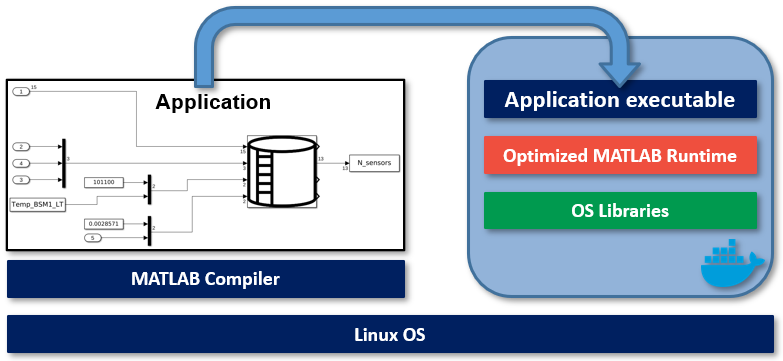
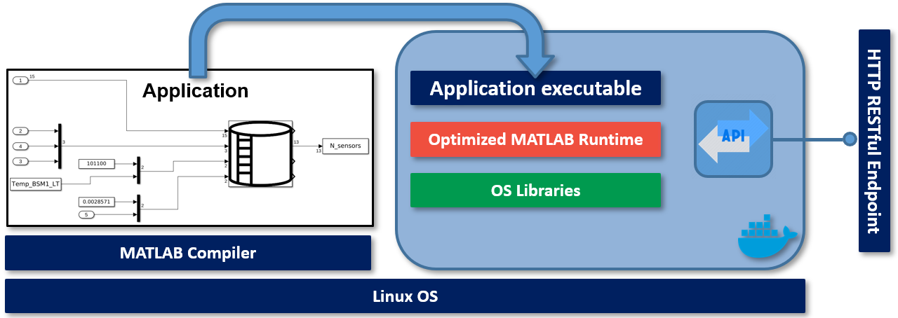

# How to deploy a Simulink model as Standalone Applications into Docker Images

The following repository is intended to document the procedure to deploy a Simulink model as a Standalone Application in a Docker container.

## I. Components installation

1. [Deployment basic requirements](./documentation/BasicReq.md). **[Required]**
2. [Install Matlab on Linux OS](./documentation/MatlabOnLinux.md). **[Required]**

## II. From compiler Matlab to Docker container

> **Note:** It is recommended to perform this step before step III.

||
|:---------------------------------------------------------------------------:|

1. [Basic function](./documentation/BasicFunctionDocker.md). **[Optional: only for testing purposes]**
2. [Deploy Simulink Model](./documentation/SimuDockerDep.md). **[Optional: only for testing purposes]**.
3. [Deploy Simulink Model with S-Fuctions](./documentation/SimS-FunctDockerDep.md). **[Optional: only for testing purposes]**
4. [Deploy a more complex Simulink Model with S-Functions](./documentation/.md). **[Required]**)

## III. From compiler to Microservice

1. [Basic function](./documentation/BasicFunctionRESTDocker.md). **[Optional: only for testing purposes]**
2. [Simulink Model](./documentation/SimuRESTDocker.md). **[Optional: only for testing purposes]**.
3. [Simulink Model with S-Fuctions](./documentation/SimS-FunctRESTDocker.md). **[Required]**

||
|:---------------------------------------------------------------------------------:|

## Add-on

1. [Calculation of model execution time](./documentation/ExecutionTime.md)

## To-do

1. [Deploy the Docker Container for a Real WWTP Model](https://es.mathworks.com/help/compiler_sdk/mps_dev_test/create-a-microservice-docker-image.html)
2. [Create Microservice Docker Image for a Real WWTP Model](https://es.mathworks.com/help/compiler_sdk/mps_dev_test/create-a-microservice-docker-image.html)
