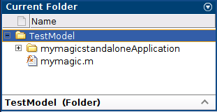
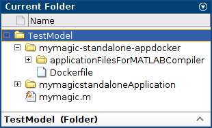

# Create Microservice Docker Image

This example shows how to create a microservice Docker image.

1. Create a folder for test: `mkdir ~/matlab_model/TestModel`
2. Create Function in MATLAB on `TestModel` folder. See *before compilation image*

    - Write a MATLAB function called `mymagic` and save it with the file name `mymagic.m`.

    ```console
    function y = mymagic(x)
        y = magic(x);
    end
    ```

    - Test the function at the MATLAB command prompt.

    ```console
    mymagic(5)
    ```

    - Expected Output:

    ```console
    17    24     1     8    15
    23     5     7    14    16
     4     6    13    20    22
    10    12    19    21     3
    11    18    25     2     9
    ```

3. Create Deployable Archive

   - Package the `mymagic` function into a deployable archive using the [compiler.build.productionServerArchive](https://es.mathworks.com/help/compiler_sdk/mps_dev_test/compiler.build.productionserverarchive.html) function.

    ```console
    mpsResults = compiler.build.productionServerArchive('mymagic.m',...
    'ArchiveName','magicarchive','Verbose','on')
    ```

    - Expected Output:

    ```console
    mpsResults = 

      Results with properties:

                      BuildType: 'productionServerArchive'
                          Files: {'/home/mluser/Work/magicarchiveproductionServerArchive/magicarchive.ctf'}
        IncludedSupportPackages: {}
                        Options: [1×1 compiler.build.ProductionServerArchiveOptions]
    ```

    - The compiler.build.Results object mpsResults contains information on the build type, generated files, included support packages, and build options.
    - Once the build is complete, the function creates a folder named `magicarchiveproductionServerArchive` in your current directory to store the deployable archive.

4. Package Archive into Microservice Docker Image

   - Build the microservice Docker image using the mpsResults object that you created.
   - You can specify additional options in the compiler.build command by using name-value arguments.

    ```console
    compiler.package.microserviceDockerImage(mpsResults,'ImageName','micro-magic')
    ```

5. The function generates the following files within a folder named micro-magicmicroserviceDockerImage in your current working directory:

   1. `applicationFilesForMATLABCompiler/magicarchive.ctf` — Deployable archive file.
   2. `Dockerfile` — Docker file that specifies Docker run-time options.
   3. `GettingStarted.txt` — Text file that contains deployment information.

6. Test the image:

    ```console
    docker ps
    ```

    - Expected Output:

    ```console
    REPOSITORY         TAG             IMAGE ID          CREATED         SIZE
    micro-magic        latest          8ec697f512af      4 hours ago     1.48GB
    ```

7. Run the micro-magic microservice image in Docker.

    ```console
    docker run --rm -p 9900:9910 micro-magic
    ```

8. Once the microservice container is running in Docker, you can check the status of the service by opening the following URL in a web browser:

    ```console
    curl http://localhost:9900/api/health
    ```

    - Expected Output:

    ```console
    {"status:  ok"}
    ```

9. Test the running service:

    ```console
    curl -v -H Content-Type:application/json -d '{"nargout":1,"rhs":[4]}' http://localhost:9900/magicarchive/mymagic
    ```

    - Expected Output:

    ```console
    *   Trying 127.0.0.1:9900...
    * TCP_NODELAY set
    * Connected to localhost (127.0.0.1) port 9900 (#0)
    > POST /magicarchive/mymagic HTTP/1.1
    > Host: localhost:9900
    > User-Agent: curl/7.68.0
    > Accept: */*
    > Content-Type:application/json
    > Content-Length: 23
    > 
    * upload completely sent off: 23 out of 23 bytes
    * Mark bundle as not supporting multiuse
    < HTTP/1.1 200 OK
    < Content-Type: application/json
    < Content-Length: 94
    < Connection: Keep-Alive
    < 
    * Connection #0 to host localhost left intact
    {"lhs":[{"mwdata":[16,5,9,4,2,11,7,14,3,10,6,15,13,8,12,1],"mwsize":[4,4],"mwtype":"double"}]}    
    ```

|       **Before compilation**       |        **After compilation**       |      **After Docker Creation**      |      **Dockerfile Visualization**       |
|:----------------------------------:|:----------------------------------:|:-----------------------------------:|:---------------------------------------:|
|| | | |
