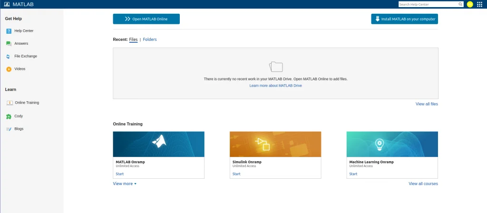

# Install Matlab On Linux

1. Log in to [Mathworks](https://matlab.mathworks.com/):

    > **Note**: Since MATLAB is proprietary software, we need a license to use it.

    - After verification is completed, you will be greeted with the MATLAB Dashboard where you can download the software.

    

2. 
