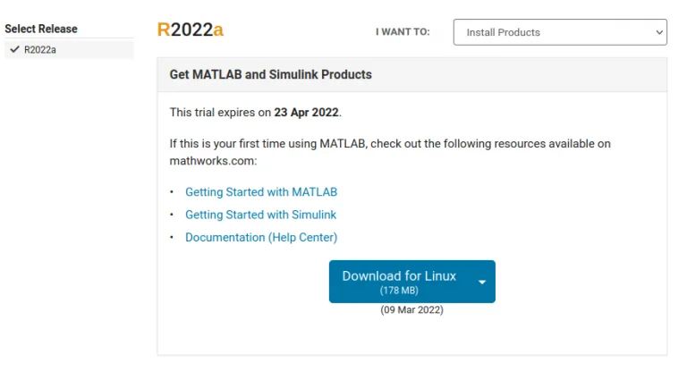
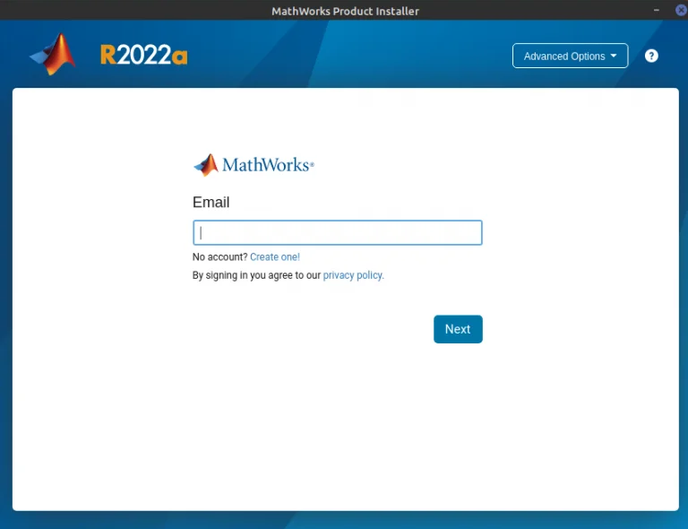
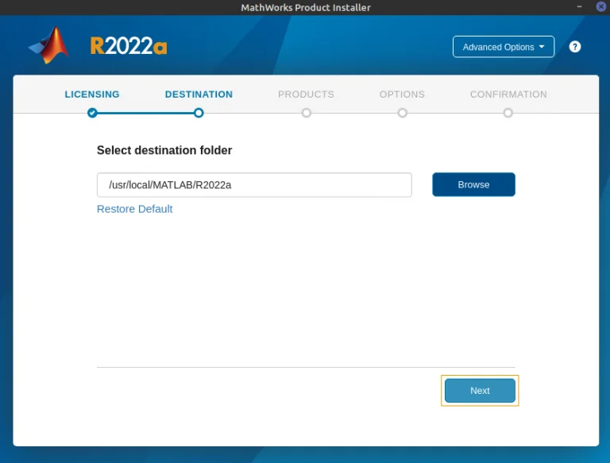
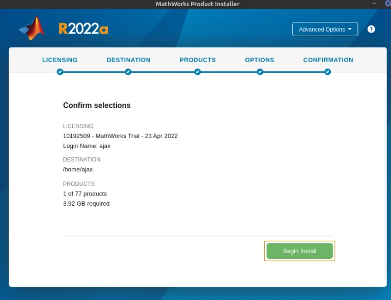

# Install Matlab On Linux

1. Log in to [Mathworks](https://matlab.mathworks.com/):

    > **Note**: Since MATLAB is proprietary software, we need a license to use it.

    - After verification is completed, you will be greeted with the MATLAB Dashboard where you can download the software.

    

2. Downloading MATLAB

    To download MATLAB, click the [“Install MATLAB on your computer”](https://in.mathworks.com/downloads/web_downloads/10192509) and then “Download for Linux”.

    

    This will download a zip file that contains your MATLAB software.

3. Install MATLAB

    - To install MATLAB, we must first unzip the downloaded folder. However, before unzipping, we will first make a separate folder, in which we can unzip the downloaded folder. I have named that folder "MATLAB" but it can be named anything.

    ```console
    mkdir MATLAB
    unzip matlab_R2022a_glnxa64.zip -d MATLAB
    ```

    - Now, go to the folder in which you unzipped all the files and execute the install script:

    ```console
    cd MATLAB
    ./install 
    ```

    - This will prompt an installation wizard asking you to log in.

    

    - After entering the email and password, you will be asked to select your license, select the destination folder, the products you want to install, and whether you want to create symbolic links in the root directory.

    

    - Products installed in our case:

        |       **Product**       | **Is Installed** |
        |:-----------------------:|:----------------:|
        |     MATLAB Compiler     |         X        |
        |       MATLAB Coder      |         X        |
        |   MATLAB Compiler SDK   |         X        |
        | MATLAB Report Generator |         X        |
        |     Mapping Toolbox     |         X        |
        |         Simulink        |         X        |
        |    Simulink Compiler    |         X        |

    > **Note**: It is possible that you don’t have sudo privileges, in which case, the installer will refuse to select /usr/local/ as the destination folder. In that case, you choose /home/ as your destination folder and so no to creating symbolic links.

    - After everything is done, it will install the product.

    

