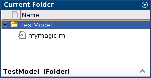
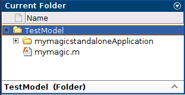
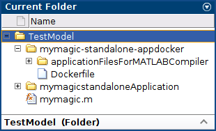

# Package MATLAB Standalone Applications into Docker Images

This example shows how to package a MATLAB® standalone application into a Docker image.

1. Create a folder for test: `mkdir ~/matlab_model/TestModel`
2. Create Function in MATLAB on `TestModel` folder. See *before compilation image*

    - Write a MATLAB function called `mymagic` and save it with the file name `mymagic.m`.

    ```console
    function mymagic(x)
    y = magic(x);
    disp(y)
    ```

    - Test the function at the MATLAB command prompt.

    ```console
    mymagic(5)
    ```

    - Expected Output:

    ```console
    17    24     1     8    15
    23     5     7    14    16
     4     6    13    20    22
    10    12    19    21     3
    11    18    25     2     9
    ```

3. Create Standalone Application

   - Make the `mymagic` function into a standalone application using the [compiler.build.standaloneApplication](https://es.mathworks.com/help/compiler/compiler.build.standaloneapplication.html) function.

    ```console
    res = compiler.build.standaloneApplication('mymagic.m', 'TreatInputsAsNumeric', true)
    ```

    - Expected Output:

    ```console
    res = 
      Results with properties:

        BuildType: 'standaloneApplication'
            Files: {3×1 cell}
          Options: [1×1 compiler.build.StandaloneApplicationOptions]
    ```

    - Once the build is complete, the function creates a folder named `mymagicstandaloneApplication` in your current directory to store the standalone application. The Results object `res` returned at the MATLAB command prompt contains information about the build. See *after compilation image*.

4. Package Standalone Application into Docker Image

    - Create DockerOptions Object

      - Prior to creating a Docker image, create a DockerOptions object using the [compiler.package.DockerOptions](https://es.mathworks.com/help/compiler/compiler.package.dockeroptions.html) function and pass the Results object res and an image name mymagic-standalone-app as input arguments. The compiler.package.DockerOptions function lets you customize Docker image packaging. See *after Docker creation image*

    ```console
    opts = compiler.package.DockerOptions(res,'ImageName','mymagic-standalone-app')
    ```

    - Expected Output:

    ```console
    opts = 
      DockerOptions with properties:

                EntryPoint: 'mymagic'
        ExecuteDockerBuild: on
                 ImageName: 'mymagic-standalone-app'
             DockerContext: './mymagic-standalone-appdocker'
    ```

    - Create Docker Image
      - Create a Docker image using the [compiler.package.docker](https://es.mathworks.com/help/compiler/compiler.package.docker.html) function and pass the Results object res and the DockerOptions object opts as input arguments.

    ```console
    compiler.package.docker(res, 'Options', opts)
    ```

    - Expected Output:

    ```console
    Generating Runtime Image
    Cleaning MATLAB Runtime installer location. It may take several minutes...
    Copying MATLAB Runtime installer. It may take several minutes...
    ...
    ...
    ...
    Successfully built 6501fa2bc057
    Successfully tagged mymagic-standalone-app:latest

    DOCKER CONTEXT LOCATION:

    /home/user/MATLAB/work/mymagic-standalone-appdocker

    SAMPLE DOCKER RUN COMMAND:

    docker run --rm -e "DISPLAY=:0" -v /tmp/.X11-unix:/tmp/.X11-unix mymagic-standalone-app
    ```

   - Once packaging is complete, the function creates a folder named mymagic-standalone-appdocker in your current directory. This folder is the Docker context and contains the *Dockerfile*.  See *Dockerfile visualization image*.
   - The compiler.package.docker function also returns the location of the Docker context and a sample Docker run command. You can use the sample Docker run command to test whether your image executes correctly.
   - During the packaging process, the necessary bits for MATLAB Runtime are packaged as a parent Docker image and the standalone application is packaged as a child Docker image.

5. Test Docker Image

   - Open a Linux terminal and navigate to the Docker context folder. Verify that the mymagic-standalone-app Docker image is listed in your list of Docker images.

    ```console
    docker images
    ```

    - Expected Output:

    ```console
    REPOSITORY                                      TAG           IMAGE ID            CREATED             SIZE
    mymagic-standalone-app                          latest        6501fa2bc057        23 seconds ago      1.03GB
    matlabruntime/r2022b/update0/4000000000000000   latest        c6eb5ba4ae69        24 hours ago        1.03GB
    ```

   - After verifying that the mymagic-standalone-app Docker image is listed in your list of Docker images, execute the sample run command with the input argument 5:

    ```console
    docker run --rm -e "DISPLAY=:0" -v /tmp/.X11-unix:/tmp/.X11-unix mymagic-standalone-app 5
    ```

    - Expected Output:

    ```console
    No protocol specified

    out =

        17    24     1     8    15
        23     5     7    14    16
         4     6    13    20    22
        10    12    19    21     3
        11    18    25     2     9
    ```

|       **Before compilation**       |        **After compilation**       |      **After Docker Creation**      |      **Dockerfile Visualization**       |
|:----------------------------------:|:----------------------------------:|:-----------------------------------:|:---------------------------------------:|
|| | | |
