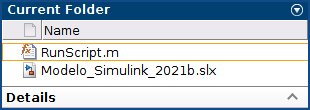

# Real Simulink Project To Docker Deployment

## Leave registration of the model and the function in this repository **[On the PC where the repository is cloned]**

1. Create a new folder in the `src` Project folder:

    ```console
    cd ~/DepSimModStandAppDocker/src/
    mkdir ~/DepSimModStandAppDocker/src/WWTP
    ```

2. Copy the `.slx` and `.m` in the created folder. E.g.: `~/DepSimModStandAppDocker/src/WWTP`.

## Use the model and the function on Matlab installation **[On the VM where Matlab is installed]**

1. Create a folder for the model deployment: `mkdir ~/matlab_model/RunScript`.
2. Copy the `.slx` and `.m` in the created folder. E.g.: `~/matlab_model/RunScript`. *See copied files image*.

    |        **Copied files**         |
    |:-------------------------------:|
    | |

3. Test the `RunScript` function:

    ```console
    RunScript()
    ```

    - Expected Output:

    ```console
    >> RunScript()
    ### Building the rapid accelerator target for model: Modelo_Simulink_2021b
    ### Successfully built the rapid accelerator target for model: Modelo_Simulink_2021b

    Build Summary

    Top model rapid accelerator targets built:

    Model                  Action                       Rebuild Reason                                    
    ======================================================================================================
    Modelo_Simulink_2021b  Code generated and compiled  Code generation information file does not exist.  

    1 of 1 models built (0 models already up to date)
    Build duration: 0h 0m 25.231s

    ans =

             0         0
        0.0100    0.0040
        0.0200    0.0146
        0.0300    0.0302
        0.0400    0.0491
        0.0500    0.0704
        0.0600    0.0930
        0.0700    0.1163
        0.0800    0.1396
        0.0900    0.1626
        0.1000    0.1848
        ......    ......
        ......    ......
        ......    ......        
    ```

4. Launch the `RunScript.m` compilation:

    ```console
    res = compiler.build.standaloneApplication('RunScript.m', 'TreatInputsAsNumeric', true)
    ```

    - Expected Output:

    ```console
    ### Building the rapid accelerator target for model: Modelo_Simulink_2021b
    ### Successfully built the rapid accelerator target for model: Modelo_Simulink_2021b

    Build Summary

    Top model rapid accelerator targets built:

    Model                  Action                       Rebuild Reason                                    
    ======================================================================================================
    Modelo_Simulink_2021b  Code generated and compiled  Code generation information file does not exist.  

    1 of 1 models built (0 models already up to date)
    Build duration: 0h 0m 24.251s

    res = 

      Results with properties:

                      BuildType: 'standaloneApplication'
                          Files: {3×1 cell}
        IncludedSupportPackages: {}
                        Options: [1×1 compiler.build.StandaloneApplicationOptions]       
    ```

5. Package Standalone Application into Docker Image:

    ```console
    opts = compiler.package.DockerOptions(res, 'ImageName', 'wwtp')
    ```

    - Expected Output:

    ```console
    opts = 

      DockerOptions with properties:

                EntryPoint: 'RunScript'
        ExecuteDockerBuild: on
                 ImageName: 'wwtp'
             DockerContext: './wwtpdocker'       
    ```

6. Create a Docker Image

    ```console
    compiler.package.docker(res, 'Options', opts)
    ```

    - Expected Output:

    ```console
    Generating Runtime Image
    Runtime Base Image Already Exists
    Cleaning MATLAB Runtime installer location. It may take several minutes...
    Installing ...
    (Nov 26, 2022 14:12:52) ##################################################################
    (Nov 26, 2022 14:12:52) #
    (Nov 26, 2022 14:12:52) # Today's Date: 
    (Nov 26, 2022 14:12:52) Sat Nov 26 14:12:52 EST 2022
    (Nov 26, 2022 14:12:52) 
    (Nov 26, 2022 14:12:52) System Info
    (Nov 26, 2022 14:12:52) OS: Linux 5.15.0-53-generic
    (Nov 26, 2022 14:12:52) Arch: amd64
    (Nov 26, 2022 14:12:52) Data Model: 64
    (Nov 26, 2022 14:12:52) Language: en
    (Nov 26, 2022 14:12:52) Java Vendor: Oracle Corporation
    (Nov 26, 2022 14:12:52) Java Home: /tmp/ubuntu/matlabruntime/docker/r2022a/release/update5/installer/sys/java/jre/glnxa64/jre
    (Nov 26, 2022 14:12:52) Java Version: 1.8.0_202
    (Nov 26, 2022 14:12:52) Java VM Name: Java HotSpot(TM) 64-Bit Server VM
    (Nov 26, 2022 14:12:52) Release Description: R2022a_Update_5
    (Nov 26, 2022 14:12:52) Java Class Path: /tmp/ubuntu/matlabruntime/docker/r2022a/release/update5/installer/java/config/installagent/pathlist.jar
    (Nov 26, 2022 14:12:52) User Name: ubuntu
    (Nov 26, 2022 14:12:52) Current Directory: /home/ubuntu/matlab_model/RunScript
    (Nov 26, 2022 14:12:52) Input arguments: 
    (Nov 26, 2022 14:12:52) root /tmp/ubuntu/matlabruntime/docker/r2022a/release/update5/installer
    (Nov 26, 2022 14:12:52) libdir /tmp/ubuntu/matlabruntime/docker/r2022a/release/update5/installer
    (Nov 26, 2022 14:12:52) destinationFolder /tmp/ubuntu/matlabruntime/docker/r2022a/release/update5/e0000000000000200
    (Nov 26, 2022 14:12:52) product.MATLAB_Runtime___Core true
    (Nov 26, 2022 14:12:52) product.MATLAB_Runtime___Non_Interactive_MATLAB true
    (Nov 26, 2022 14:12:52) product.MATLAB_Runtime___Numerics true
    (Nov 26, 2022 14:12:52) product.MATLAB_Runtime___Rapid_Accelerator true
    (Nov 26, 2022 14:12:52) agreeToLicense yes   
    ............................................................................................................................................................
    ............................................................................................................................................................
    ............................................................................................................................................................

    Step 1/3 : FROM matlabruntimebase/r2022a/release/update5
     ---> d568a1ded9cd
    Step 2/3 : COPY ./v912 /opt/matlabruntime/v912
     ---> 7cf9de3ac93f
    Step 3/3 : ENV LD_LIBRARY_PATH /opt/matlabruntime/v912/runtime/glnxa64:/opt/matlabruntime/v912/bin/glnxa64:/opt/matlabruntime/v912/sys/os/glnxa64:/opt/matlabruntime/v912/sys/  opengl/lib/glnxa64:/opt/matlabruntime/v912/extern/bin/glnxa64
     ---> Running in 75b83a482187
    Removing intermediate container 75b83a482187
     ---> dc12891158c3
    Successfully built dc12891158c3
    Successfully tagged matlabruntime/r2022a/release/update5/e0000000000000200:latest
    Sending build context to Docker daemon  292.9kB


    Step 1/6 : FROM matlabruntime/r2022a/release/update5/e0000000000000200
     ---> dc12891158c3
    Step 2/6 : COPY ./applicationFilesForMATLABCompiler /usr/bin/mlrtapp
     ---> 554cef186ab0
    Step 3/6 : RUN chmod -R a+rX /usr/bin/mlrtapp/*
     ---> Running in b8dd6cfc796e
    Removing intermediate container b8dd6cfc796e
     ---> c1c6e8b4a773
    Step 4/6 : RUN useradd -ms /bin/bash appuser
     ---> Running in 6582101336d3
    Removing intermediate container 6582101336d3
     ---> 1f006a5251a0
    Step 5/6 : USER appuser
     ---> Running in 2eed638f398c
    Removing intermediate container 2eed638f398c
     ---> dc1c7bd5d23e
    Step 6/6 : ENTRYPOINT ["/usr/bin/mlrtapp/RunScript"]
     ---> Running in 31002867e03a
    Removing intermediate container 31002867e03a
     ---> 819f8be5e2ac
    Successfully built 819f8be5e2ac
    Successfully tagged wwtp:latest

    DOCKER CONTEXT LOCATION:

    /home/ubuntu/matlab_model/RunScript/wwtpdocker

    SAMPLE DOCKER RUN COMMAND:

    docker run --rm -e "DISPLAY=:0" -v /tmp/.X11-unix:/tmp/.X11-unix wwtp

    EXECUTE xhost + ON THE HOST MACHINE TO VIEW CONTAINER GRAPHICS
    ```

7. Test the Docker Image

    ```console
    docker images
    ```

    - Expected Output:

    ```console
    REPOSITORY                                      TAG           IMAGE ID            CREATED             SIZE
    wwtp                                            latest        819f8be5e2ac        39 hours ago        3.22GB
    matlabruntime/r2022a/update5/e000000000000200   latest        c6eb5ba4ae69        24 hours ago        1.03GB
    ```

8. Run the `wwtp` image:

    ```console
    docker run --rm -e "DISPLAY=:0" -v /tmp/.X11-unix:/tmp/.X11-unix wwtp
    ```

    - Expected Output:

    ```console
             0         0
        0.0100    0.0040
        0.0200    0.0146
        0.0300    0.0302
        0.0400    0.0491
        0.0500    0.0704
        0.0600    0.0930
        0.0700    0.1163
        0.0800    0.1396
        0.0900    0.1626
        0.1000    0.1848
        ......    ......
        ......    ......
        ......    ...... 
    ```
