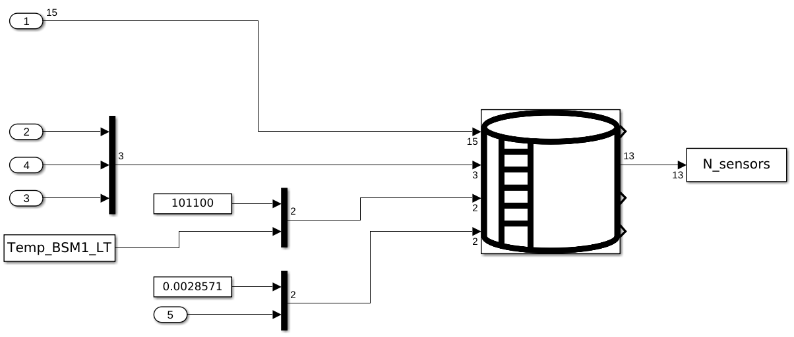
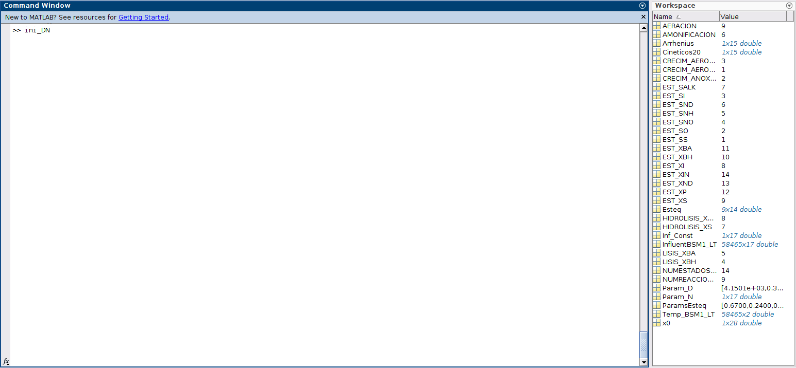
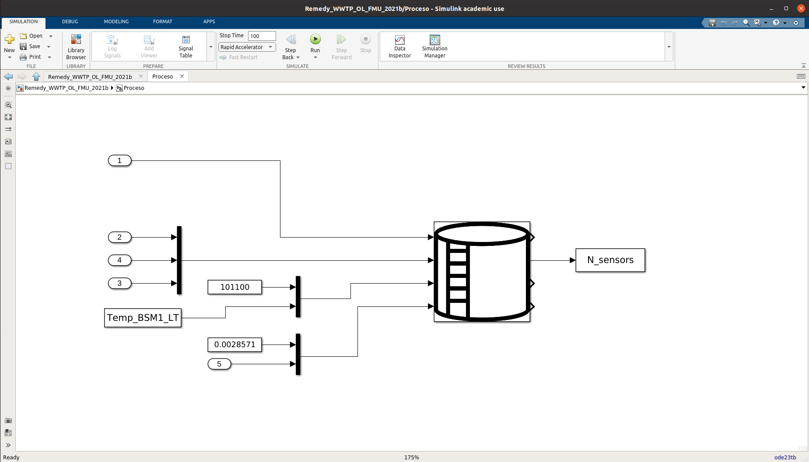

# Simulink Project with S-Function To Docker Deployment

This tutorial help to compile and containerize the next Simulink Project:



## Create the Docker container **[On the VM where Matlab is installed]**

1. Clone this repository.
2. Go to the `src` folder: `cd ~/DepSimModStandAppDocker/src`.
3. Copy the `sample-wwtp` folder in the `~/matlab_model/` folder: `cp ./sample-wwtp ~/matlab_model/`.
4. Open Matlab considering same folder established in the [installation tutorial](./MatlabOnLinux.md):

    ```console
    cd ~/MATLAB/R2022a/bin/
    ./matlab
    ```

5. Go to the `sample-wwtp` folder inside of Matlab.
7. Compile the Matlab S-Function:

    ```console
    mex DN_process.c
    ```

    - Expected Output:

    ```console
    Building with 'gcc'.
    Mex completed successfully.
    ```

    - The output file: `DN_process.mexa64` is generated.

8. Load in Matlab environment the ini_DN.m variables:

    ```console
    ini_DN
    ```

    - Expected Output:

    

9. Open the `.slx` file in Simulink and *Run* it in order to generate the `slprj` folder.

    - Expected Output:

    

    - Close the window after the simulation finish.

10. Test the `RunScript` function on the Matlab cmd:

    ```console
    RunScript()
    ```

    - Expected Output:

    ```console
    >> RunScript()
    0.0012
    0.0012
    0.0012
    0.0012
    0.0012
    0.0012
    0.0012
    0.0012
    0.0012
    0.0012
    0.0012
    0.0012
    0.0012
    0.0012
    0.0012
    0.0012
    0.0012
    0.0012
    ......
    ......
    ......
    ```

11. Launch the `RunScript.m` compilation including the `AdditionalFiles` property:

    ```console
    res = compiler.build.standaloneApplication('RunScript.m', 'TreatInputsAsNumeric', true, 'AdditionalFiles', ["ini_DN.m","Input_Data.mat"])
    ```

    - Expected Output:

    ```console

    Build Summary

    0 of 1 models built (1 models already up to date)
    Build duration: 0h 0m 3.5325s

    res = 

    Results with properties:

                      BuildType: 'standaloneApplication'
                          Files: {3×1 cell}
        IncludedSupportPackages: {}
                        Options: [1×1 compiler.build.StandaloneApplicationOptions]
    ```

12. Package Standalone Application into Docker Image:

    ```console
    opts = compiler.package.DockerOptions(res, 'ImageName', 'sflorenz05/sample_wwtp')
    ```

    - Expected Output:

    ```console
    opts =

      DockerOptions with properties:

                EntryPoint: 'RunScript'
        ExecuteDockerBuild: on
                 ImageName: 'sflorenz05/wwtp'
             DockerContext: './sflorenz05/sample_wwtpdocker'
    ```

13. Create a Docker Image

    ```console
    compiler.package.docker(res, 'Options', opts)
    ```

    - Expected Output:

    ```console
    Runtime Image Already Exists
    Sending build context to Docker daemon  557.1kB
    Sending build context to Docker daemon  4.456MB
    Sending build context to Docker daemon  8.356MB
    Sending build context to Docker daemon   11.1MB


    Step 1/6 : FROM matlabruntime/r2022a/release/update5/e0000000000000200
     ---> dc12891158c3
    Step 2/6 : COPY ./applicationFilesForMATLABCompiler /usr/bin/mlrtapp
     ---> 4f44e9169b92
    Step 3/6 : RUN chmod -R a+rX /usr/bin/mlrtapp/*
     ---> Running in 6b4a3b40dcc5
    Removing intermediate container 6b4a3b40dcc5
     ---> 4c7c29a2253f
    Step 4/6 : RUN useradd -ms /bin/bash appuser
     ---> Running in bea321274686
    Removing intermediate container bea321274686
     ---> 93744760564e
    Step 5/6 : USER appuser
     ---> Running in 5abe48e76ae1
    Removing intermediate container 5abe48e76ae1
     ---> a1b25420b905
    Step 6/6 : ENTRYPOINT ["/usr/bin/mlrtapp/RunScript"]
     ---> Running in 99ad37ccca31
    Removing intermediate container 99ad37ccca31
     ---> 63eff14be9e5
    Successfully built 63eff14be9e5
    Successfully tagged sflorenz05/wwtp:latest

    DOCKER CONTEXT LOCATION:

    /home/ubuntu/matlab_model/TestSFunction/sflorenz05/wwtpdocker

    SAMPLE DOCKER RUN COMMAND:

    docker run --rm -e "DISPLAY=:0" -v /tmp/.X11-unix:/tmp/.X11-unix sflorenz05/wwtp

    EXECUTE xhost + ON THE HOST MACHINE TO VIEW CONTAINER GRAPHICS.
    ```

14. Full project overview:

    |                |
    |:--------------------------------------------:|
    |          **Full Project Overview**           |
