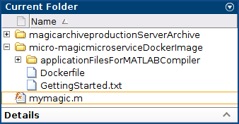

# Create Microservice Docker Image

1. Clone the repository: `git clone https://github.com/sfl0r3nz05/DepSimModStandAppDocker.git`
2. Go into the project folder `cd ~/DistributedBchFWArchIoT/src/sample-wwtp` using Matlab:

   

3. Create Deployable Archive

   - Creates a deployable archive with options specified

    ```console
    opts = compiler.build.ProductionServerArchiveOptions('RunScript.m',...
    'ArchiveName','sample_wwtp',...
    'AdditionalFiles',["ini_DN.m","Input_Data.mat"],...
    'AutoDetectDataFiles','on',...
    'Verbose','on')
    ```

    - Expected Output:

    ```console
    opts = 

    ProductionServerArchiveOptions with properties:

              ArchiveName: 'sample_wwtp'
           FunctionFiles: {'/home/usuario/DepSimModStandAppDocker/src/sample-wwtp/RunScript.m'}
       FunctionSignatures: ''
          AdditionalFiles: {'/home/usuario/DepSimModStandAppDocker/src/sample-wwtp/Input_Data.mat'}
      AutoDetectDataFiles: on
          SupportPackages: {'autodetect'}
                  Verbose: on
                OutputDir: './sample_wwtpproductionServerArchive'
    ```

   - Package the `RunScript` function into a deployable archive using the [compiler.build.productionServerArchive](https://es.mathworks.com/help/compiler_sdk/mps_dev_test/compiler.build.productionserverarchive.html) function.

    ```console
    mpsResults=compiler.build.productionServerArchive(opts)
    ```

    - Expected Output:

    ```console
    mcc -W CTF:sample_wwtp -d ./sample_wwtpproductionServerArchive -v -a /home/usuario/DepSimModStandAppDocker/src/sample-wwtp/Input_Data.mat -Z autodetect -U /home/usuario/DepSimModStandAppDocker/src/sample-wwtp/RunScript.m
    Compiler version: 8.4 (R2022a)
    Analyzing file dependencies. 
    ### Generating code and artifacts to 'Model specific' folder structure
    ### Generating code into build folder: /home/usuario/DepSimModStandAppDocker/src/sample-wwtp/slprj/raccel_deploy/Remedy_WWTP_OL_FMU_2021b
    ### Saving binary information cache.

    Build Summary

    0 of 1 models built (1 models already up to date)
    Build duration: 0h 0m 1.4837s
    Parsing file "/home/usuario/DepSimModStandAppDocker/src/sample-wwtp/RunScript.m"
      (referenced from command line).
    Generating file "/home/usuario/DepSimModStandAppDocker/src/sample-wwtp/sample_wwtpproductionServerArchive/readme.txt".

    mpsResults = 

      Results with properties:

                      BuildType: 'productionServerArchive'
                          Files: {'/home/usuario/DepSimModStandAppDocker/src/sample-wwtp/sample_wwtpproductionServerArchive/sample_wwtp.ctf'}
        IncludedSupportPackages: {}
                        Options: [1×1 compiler.build.ProductionServerArchiveOptions]
    ```

    - The compiler.build.Results object mpsResults contains information on the build type, generated files, included support packages, and build options.
    - Once the build is complete, the function creates a folder named `sample_wwtpproductionServerArchive` in your current directory to store the deployable archive.
      - *See the compilation image*

        ||
        |:------------------------------------:|

4. Package Archive into Microservice Docker Image

   - Build the microservice Docker image using the mpsResults object that you created.
   - You can specify additional options in the compiler.build command by using name-value arguments.

    ```console
    compiler.package.microserviceDockerImage(mpsResults,'ImageName','micro-magic')
    ```

    - Expected Output:

    ```console
    Runtime Image Already Exists
    Sending build context to Docker daemon  34.82kB


    Step 1/6 : FROM matlabruntime/r2022a/release/update5/21000000000000000
      ---> ad58363ceb4a
    Step 2/6 : COPY ./applicationFilesForMATLABCompiler /usr/bin/mlrtapp
      ---> d5bee0724803
    Step 3/6 : RUN chmod -R a+rX /usr/bin/mlrtapp/*
      ---> Running in fcfebc2cff44
    Removing intermediate container fcfebc2cff44
      ---> f1fafe2cc595
    Step 4/6 : RUN useradd -ms /bin/bash appuser
      ---> Running in fe85c3cc0c67
    Removing intermediate container fe85c3cc0c67
      ---> ff1ce2305910
    Step 5/6 : USER appuser
      ---> Running in 6b976bfd4b18
    Removing intermediate container 6b976bfd4b18
      ---> dc0fba8b0a53
    Step 6/6 : ENTRYPOINT ["/opt/matlabruntime/v912/bin/glnxa64/muserve", "-a", "/usr/bin/mlrtapp/magicarchive.ctf"]
      ---> Running in b686805c0d56
    Removing intermediate container b686805c0d56
      ---> 8ec697f512af
    Successfully built 8ec697f512af
    Successfully tagged micro-magic-v4:latest

    DOCKER CONTEXT LOCATION:

    /home/ubuntu/matlab_model/TestModel/micro-magic-v4microserviceDockerImage


    FOR HELP GETTING STARTED WITH MICROSERVICE IMAGES, PLEASE READ:

    /home/ubuntu/matlab_model/TestModel/micro-magic-v4microserviceDockerImage/GettingStarted.txt
    ```

5. The function generates the following files within a folder named micro-magicmicroserviceDockerImage in your current working directory:

   1. `applicationFilesForMATLABCompiler/magicarchive.ctf` — Deployable archive file.
   2. `Dockerfile` — Docker file that specifies Docker run-time options.
   3. `GettingStarted.txt` — Text file that contains deployment information.
      - *See the packaging image*

          ||
          |:----------------------------------------:|

6. Test the image:

    ```console
    docker ps
    ```

    - Expected Output:

    ```console
    REPOSITORY         TAG             IMAGE ID          CREATED         SIZE
    micro-magic        latest          8ec697f512af      4 hours ago     1.48GB
    ```

7. Run the micro-magic microservice image in Docker.

    ```console
    docker run --rm -p 9900:9910 micro-magic
    ```

8. Once the microservice container is running in Docker, you can check the status of the service by opening the following URL in a web browser:

    ```console
    curl http://localhost:9900/api/health
    ```

    - Expected Output:

    ```console
    {"status:  ok"}
    ```

9. Test the running service:

    ```console
    curl -v -H Content-Type:application/json -d '{"nargout":1,"rhs":[4]}' http://localhost:9900/magicarchive/mymagic
    ```

    - Expected Output:

    ```console
    *   Trying 127.0.0.1:9900...
    * TCP_NODELAY set
    * Connected to localhost (127.0.0.1) port 9900 (#0)
    > POST /magicarchive/mymagic HTTP/1.1
    > Host: localhost:9900
    > User-Agent: curl/7.68.0
    > Accept: */*
    > Content-Type:application/json
    > Content-Length: 23
    > 
    * upload completely sent off: 23 out of 23 bytes
    * Mark bundle as not supporting multiuse
    < HTTP/1.1 200 OK
    < Content-Type: application/json
    < Content-Length: 94
    < Connection: Keep-Alive
    < 
    * Connection #0 to host localhost left intact
    {"lhs":[{"mwdata":[16,5,9,4,2,11,7,14,3,10,6,15,13,8,12,1],"mwsize":[4,4],"mwtype":"double"}]}    
    ```
