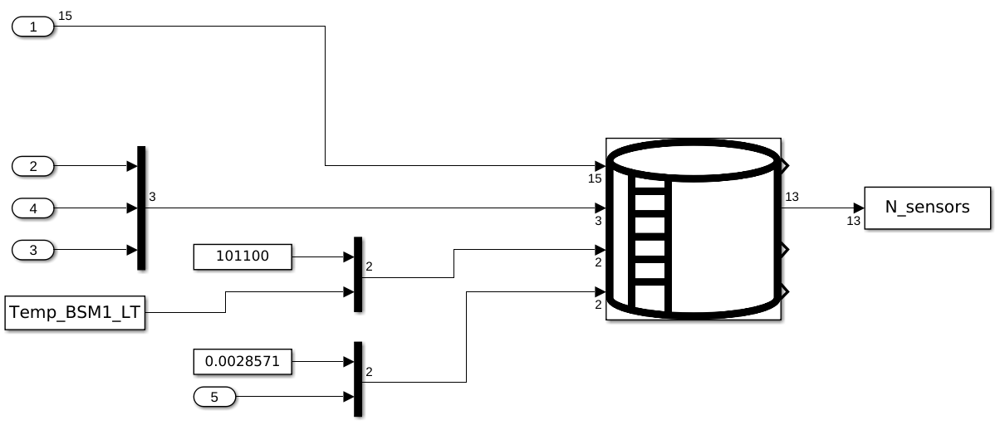

# Simulink Project with S-Function To Docker Deployment

This tutorial help to compile and containerize the next Simulink Project:



## Create the Docker container **[On the VM where Matlab is installed]**

1. Clone this repository.
2. Go to the `src` folder: `cd ~/DepSimModStandAppDocker/src`.
3. Copy the `wwtp` folder in the `~/matlab_model/` folder: `cp ./wwtp ~/matlab_model/`.
4. Open Matlab considering same folder established in the [installation tutorial](./MatlabOnLinux.md):

    ```console
    cd ~/MATLAB/R2022a/bin/
    cp ./matlab`
    ```

5. Go to the `wwtp` folder inside of Matlab.
6. 
7. Test the `RunScript` function on the Matlab cmd:

    ```console
    RunScript()
    ```

    - Expected Output:

    ```console
    >> RunScript()
    0.0012
    0.0012
    0.0012
    0.0012
    0.0012
    0.0012
    0.0012
    0.0012
    0.0012
    0.0012
    0.0012
    0.0012
    0.0012
    0.0012
    0.0012
    0.0012
    0.0012
    0.0012
    ......
    ......
    ......
    ```
